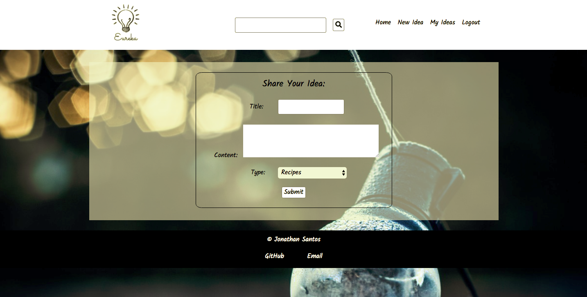

## "Idea Bank" | Thinkful Node Capstone
The Eureka app is an idea-sharing platform made for organizations like para-churches to connect ideas that different members have to benefit the community at large. It allows ideas to be shared so all users, regardless of physical location, and quickly see and learn how to implement the idea.

## Screenshots

### Login Page 
  

### Sign Up Page

### Landing Page

### New Entry Page
 

### My Entries Page

### Edit Entry Page
 

### Delete Entry Page

## User Cases
This app is for three types of communities who want an easier way to share ideas with one another. You can share a variety of different category of items with one another, view and even edit your posts. And your posts are searchable to the community at large!

### UI Flow

### Wireframe

## Working Prototype
You can access a working prototype of the app here: https://idea-bank-capstone.herokuapp.com/

## Functionality
The app's functionality includes:
* Every User has the ability to create an account that posts ideas searchable to other users
* User can Add Entries, Update Entries, and Delete Entries

## Technology
* Front-End: HTML5 | CSS3 | JavaScript ES6 | jQuery
* Back-End: Node.js | Express.js | Mocha | Chai | RESTful API Endpoints | MongoDB | Mongoose

## Responsive
App is strongly built to be usuable on mobile devices, as well as responsive across mobile, tablet, laptop, and desktop screen resolutions.

## Development Roadmap
This is v1.0 of the app, but future enhancements are expected to include:
* Image upload for users
* Commenting on posts